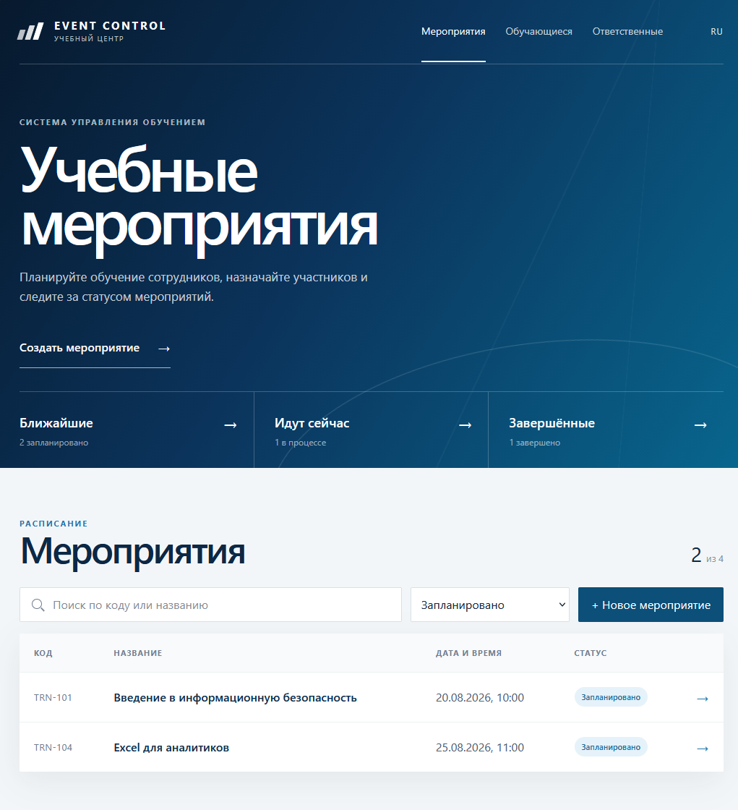
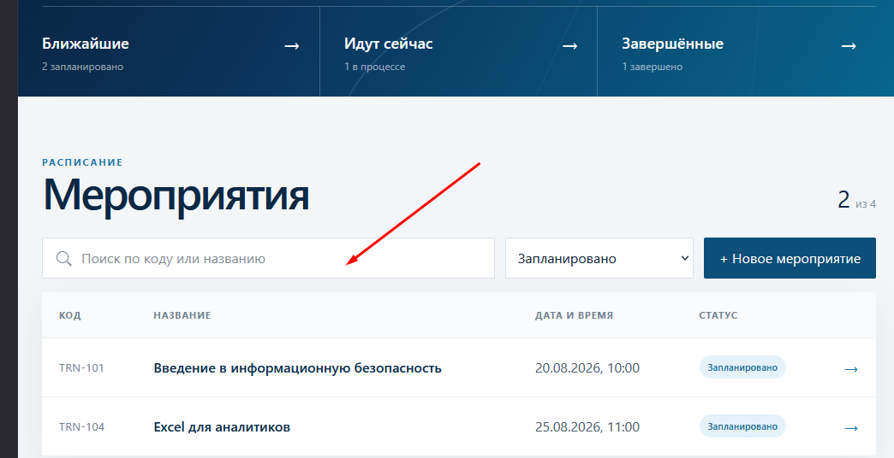
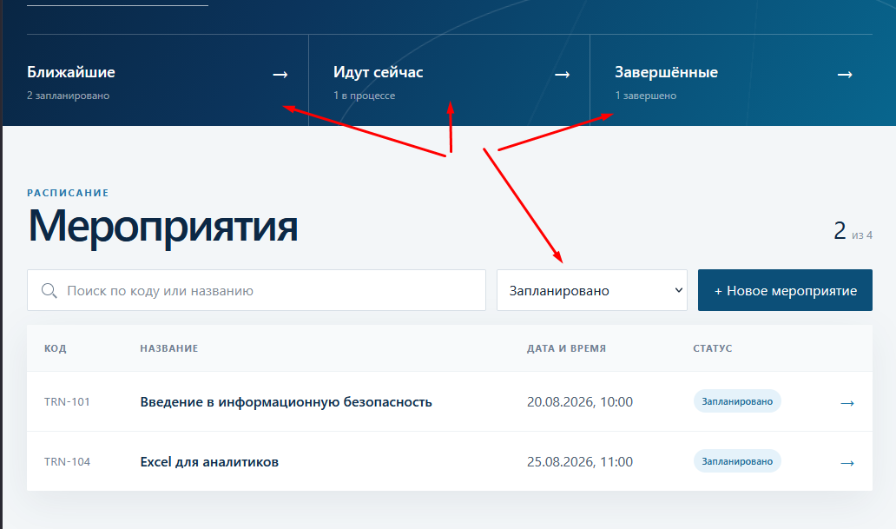
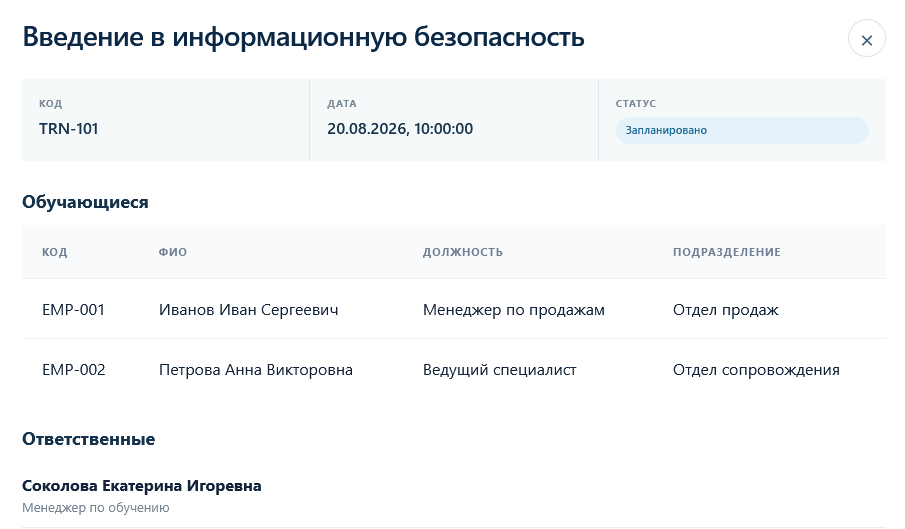
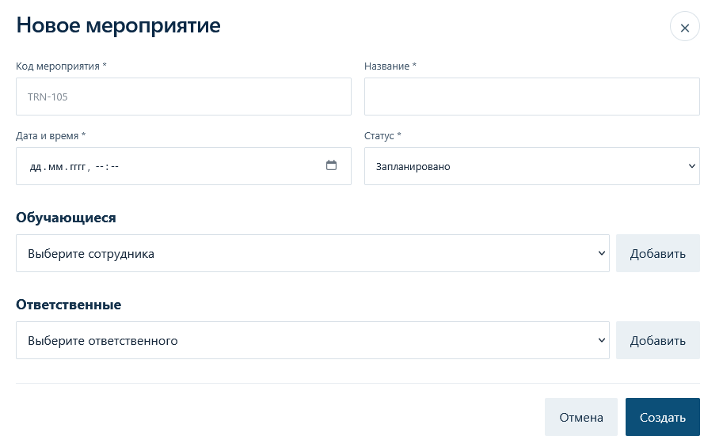

# Учебные мероприятия

Небольшое SPA-приложение для работы со списком учебных мероприятий.

Проект выполнен на React + TypeScript. Для хранения данных используется простой Node.js API, который сохраняет мероприятия в JSON-файл. Это позволяет не терять созданные записи после перезагрузки страницы или перезапуска контейнера.

## Возможности

В приложении можно:

* просматривать список мероприятий;
* искать мероприятие по коду или названию;
* фильтровать мероприятия по статусу;
* открывать подробную информацию о мероприятии;
* просматривать список обучающихся;
* просматривать список ответственных;
* создавать новые мероприятия;
* добавлять обучающихся и ответственных;
* проверять заполнение обязательных полей;
* проверять уникальность кода мероприятия.

Интерфейс приложения выполнен в светло-синей стилистике с использованием сайта аэропорта Шереметьево в качестве визуального референса.

## Стек

* React
* TypeScript
* Vite
* Node.js
* Nginx
* Docker
* Docker Compose

Дополнительная база данных не используется.

Мероприятия сохраняются в:

```text
data/events.json
```

## Структура проекта

```text
.
├── data/
│   └── events.json
│
├── src/
│   ├── components/
│   │   ├── CreateEventModal.tsx
│   │   ├── EventModal.tsx
│   │   ├── EventTable.tsx
│   │   ├── Modal.tsx
│   │   └── StatusBadge.tsx
│   │
│   ├── data/
│   │   └── mockData.ts
│   │
│   ├── App.tsx
│   ├── main.tsx
│   ├── styles.css
│   └── types.ts
│
├── server.mjs
├── nginx.conf
├── Dockerfile
├── docker-compose.yml
├── package.json
└── README.md
```

`src/components` содержит компоненты таблицы, модальных окон и элементов интерфейса.

`src/data/mockData.ts` содержит моковые данные обучающихся и ответственных.

`App.tsx` содержит основное состояние приложения, фильтрацию, поиск и работу с мероприятиями.

`server.mjs` реализует небольшой API для чтения и записи мероприятий.

`data/events.json` используется как простое хранилище мероприятий.

## Запуск без Docker

Для запуска потребуется Node.js 20.19 или новее.

Установить зависимости:

```bash
npm install
```

Запустить приложение в режиме разработки:

```bash
npm run dev
```

Для production-сборки:

```bash
npm run build
```

## Запуск через Docker

Собрать и запустить приложение:

```bash
docker compose up --build
```

После запуска приложение будет доступно по адресу:

```text
http://localhost:8080
```

Для остановки:

```bash
docker compose down
```

Данные из `data/events.json` находятся вне контейнера и не удаляются при его перезапуске.

## Работа с мероприятиями

### Список мероприятий

На главной странице отображается таблица со всеми мероприятиями.

Для каждого мероприятия выводятся:

* код;
* название;
* дата и время;
* статус.




### Поиск

Для поиска мероприятия можно использовать поле над таблицей.

Поиск выполняется по:

* коду мероприятия;
* названию мероприятия.



### Фильтрация

Для отображения мероприятий с определённым статусом используется выпадающий список.




### Просмотр мероприятия

При нажатии на строку мероприятия открывается модальное окно с подробной информацией.



В нём отображаются:

* название;
* код;
* дата;
* статус;
* ответственные;
* обучающиеся.

Для обучающихся указываются:

* код;
* ФИО;
* должность;
* подразделение.

### Создание мероприятия

Для добавления нового мероприятия необходимо нажать кнопку **«Новое мероприятие»**.



В форме необходимо указать:

* код;
* название;
* дату и время;
* статус.

Также можно выбрать обучающихся и ответственных.

Перед сохранением выполняется проверка обязательных полей и уникальности кода мероприятия.

После создания мероприятие добавляется в общий список и записывается в:

```text
data/events.json
```

Поэтому после обновления страницы созданные данные сохраняются.

## API

Для работы с мероприятиями используется небольшой локальный API.

Получение списка мероприятий:

```http
GET /api/events
```

Создание мероприятия:

```http
POST /api/events
```

Пример данных нового мероприятия:

```json
{
  "code": "TRN-105",
  "title": "Обучение сотрудников",
  "date": "2026-08-30T12:00",
  "status": "planned",
  "learners": [],
  "responsibles": []
}
```

При создании сервер самостоятельно добавляет идентификатор и сохраняет данные в JSON-файл.

## Примечание

Проект выполнен как тестовое SPA-приложение, поэтому для хранения данных используется JSON вместо полноценной базы данных.

При необходимости текущий API можно заменить на полноценный backend и базу данных без существенного изменения клиентской части приложения.
